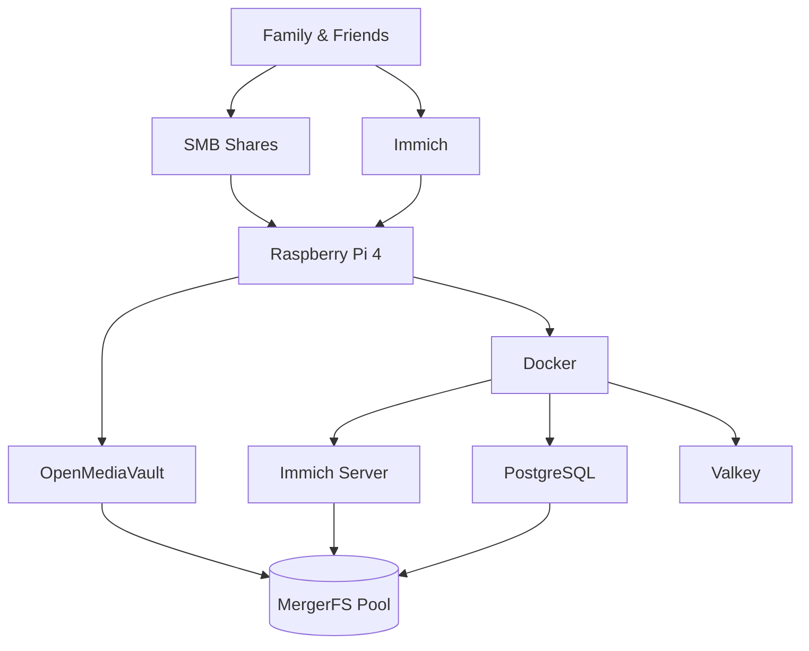
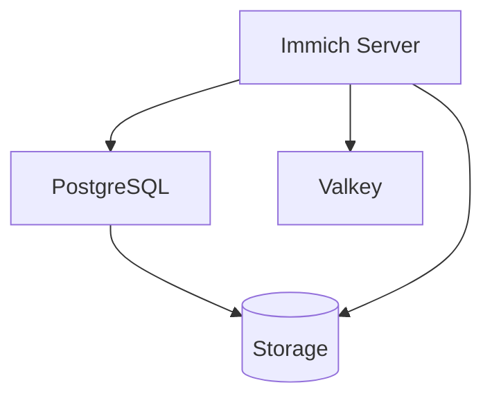
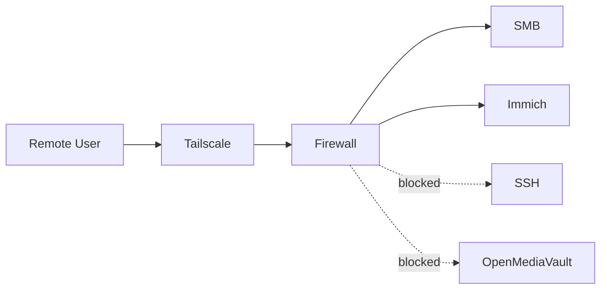

# PiCloud

> Self-hosted personal cloud infrastructure built on a Raspberry Pi 4, designed to provide private file storage and photo management for family and friends.

PiCloud serves as a private alternative to Google Drive and Google Photos while maintaining complete ownership of data, low operating costs, and a security-first architecture.

---

# Overview

PiCloud combines:

- Centralized file storage via SMB/Samba

- Self-hosted photo management via Immich

- Secure remote access via Tailscale

- OpenMediaVault for storage administration

- Docker-based service deployment

- Firewall-enforced network segmentation

The system is designed to run 24/7 on low-power hardware while remaining simple to maintain and expand.

---

# Hardware

| Component        | Specification                        |
| ---------------- | ------------------------------------ |
| Platform         | Raspberry Pi 4 Model B               |
| CPU              | Broadcom BCM2711 (4 Cores @ 1.8 GHz) |
| RAM              | 4 GB LPDDR4                          |
| System Storage   | 64 GB MicroSD                        |
| Data Storage     | 1 TB External HDD                    |
| Network          | Gigabit Ethernet                     |
| Operating System | Debian GNU/Linux 13 (Trixie)         |

---

# Software Stack

| Component         | Purpose                    |
| ----------------- | -------------------------- |
| Debian 13         | Base operating system      |
| OpenMediaVault    | Storage administration     |
| Docker            | Container runtime          |
| Immich            | Photo and video management |
| PostgreSQL        | Immich database            |
| Valkey            | Cache and background jobs  |
| Samba             | File sharing               |
| Tailscale         | Remote access              |
| MergerFS          | Future storage expansion   |
| Monit             | Service monitoring         |
| OMV Notifications | Email alerts               |

---

# Infrastructure Architecture



---

# Storage Architecture

Current storage consists of a single 1 TB HDD mounted as an ext4 filesystem.

Although only one physical disk is currently installed, storage is already exposed through a MergerFS pool to simplify future expansion.

```text
/dev/sda1 (ext4)
        │
        ▼
/srv/dev-disk-by-uuid-*
        │
        ▼
MergerFS Pool
/srv/mergerfs/storage
        │
 ┌──────┴──────┐
 │             │
 ▼             ▼
drive/      immich/
```

## Shared Storage

```text
drive/
└── User/
    ├── Backups/
    ├── Data/
    └── Media/
```

## Immich Storage

```text
immich/
└── data/
    ├── backups/
    ├── encoded-video/
    ├── library/
    ├── profile/
    ├── thumbs/
    └── upload/
```

---

# Docker Architecture

Immich runs as an isolated Docker stack.



Current containers:

| Container       | Purpose             |
| --------------- | ------------------- |
| immich_server   | Web application     |
| immich_postgres | PostgreSQL database |
| immich_redis    | Valkey cache        |

---

# Network Architecture

PiCloud supports both local and remote access.

## Local Network

Devices connected to the LAN can access:

- SMB shares

- Immich

- ICMP (ping)

Administrative services are restricted.

## Remote Access

Remote access is provided through Tailscale.

No ports are exposed directly to the Internet.



---

# Security Model

The firewall follows a default-deny approach.

## User Access

Available services:

| Service | Port        |
| ------- | ----------- |
| SMB     | TCP 139     |
| SMB     | TCP 445     |
| NetBIOS | UDP 137-138 |
| Immich  | TCP 2283    |

## Administrative Access

Administrative services are only accessible from a dedicated workstation.

| Service | Port |
| ------- | ---- |
| SSH     | 22   |
| HTTP    | 80   |
| HTTPS   | 443  |

All other traffic is denied.

---

# Tailscale Access Control

Remote users are restricted through Tailscale ACLs.

Permitted services:

- SMB

- Immich

Administrative interfaces are intentionally excluded from remote access permissions.

This reduces the attack surface and prevents accidental exposure of management services.

---

# SD Card Protection

To reduce wear on the system microSD card, OpenMediaVault's write cache is enabled.

Several high-write directories are cached in memory using overlay filesystems:

- /var/log

- /var/tmp

- /var/cache/samba

- /var/lib/rrdcached

- /var/lib/monit

This minimizes unnecessary writes and extends the lifespan of the boot media.

---

# Monitoring & Alerts

OpenMediaVault is configured to send email notifications for system events.

Examples include:

- Storage events

- Service failures

- SMART warnings

- System notifications

This enables proactive maintenance and faster incident detection.

---

# Design Decisions

## Why Raspberry Pi 4?

- Low power consumption

- Silent operation

- Affordable hardware

- Sufficient performance for intended workloads

## Why OpenMediaVault?

- Simple administration

- Debian-based ecosystem

- Excellent NAS tooling

## Why SMB?

- Native Windows support

- Broad compatibility

- Easy integration with existing workflows

## Why Tailscale?

- No port forwarding

- No public IP requirements

- Secure remote access

- Simplified user onboarding

## Why Immich?

- Modern Google Photos replacement

- Active development

- Mobile backup support

- Multi-user capabilities

---

# Reliability

Current reliability measures include:

- Firewall segmentation

- Tailscale ACLs

- Docker isolation

- Email alerts

- SMART monitoring

- SD card write protection

- User authentication

---

# Known Limitations

Current storage architecture does not provide redundancy.

Failure scenarios:

### SD Card Failure

- Operating system reinstallation required

- Configuration recovery required

### HDD Failure

- Complete data loss

### Accidental Deletion

- No backup recovery currently available

---

# Future Roadmap

## Storage

- Additional HDDs

- SnapRAID parity protection

- Storage redundancy

## Operations

- Automated backups

- Backup validation

- Disaster recovery documentation

## Monitoring

- Grafana dashboards

- Prometheus metrics

- Resource alerting

## Power Protection

- UPS integration

- Graceful shutdown procedures

---

# Philosophy

PiCloud is built around a simple idea:

> Personal cloud services should be private, affordable, maintainable and under the owner's control.

Rather than relying on subscription-based cloud providers, PiCloud prioritizes data ownership, simplicity and long-term sustainability using open-source software and commodity hardware.
